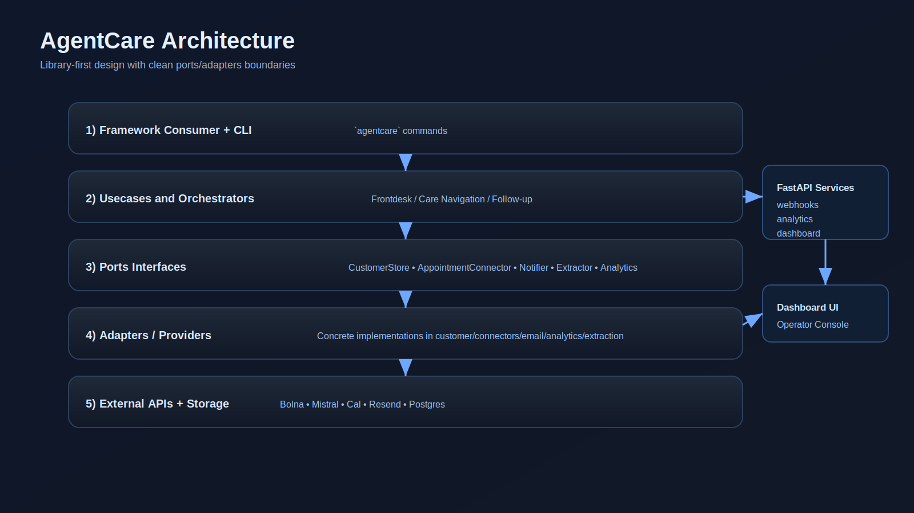
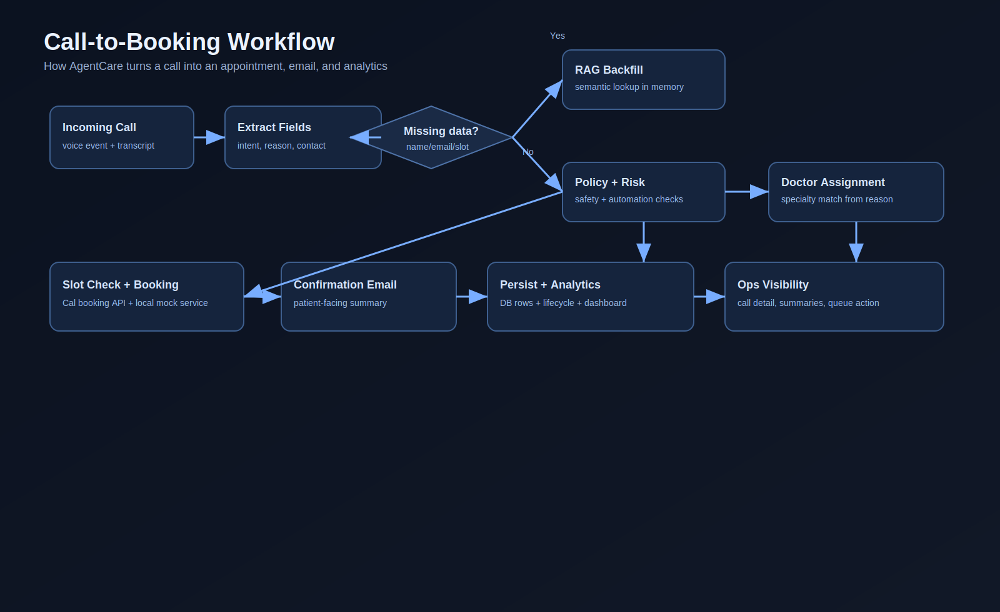
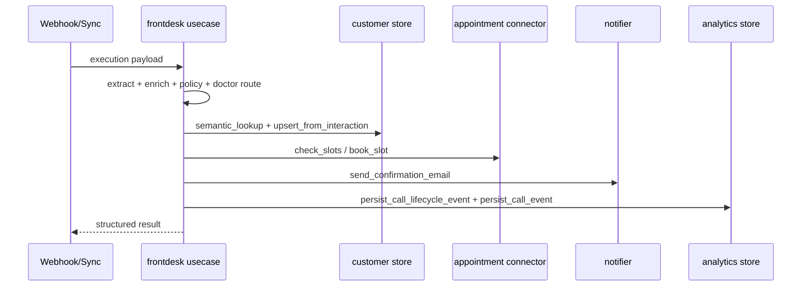
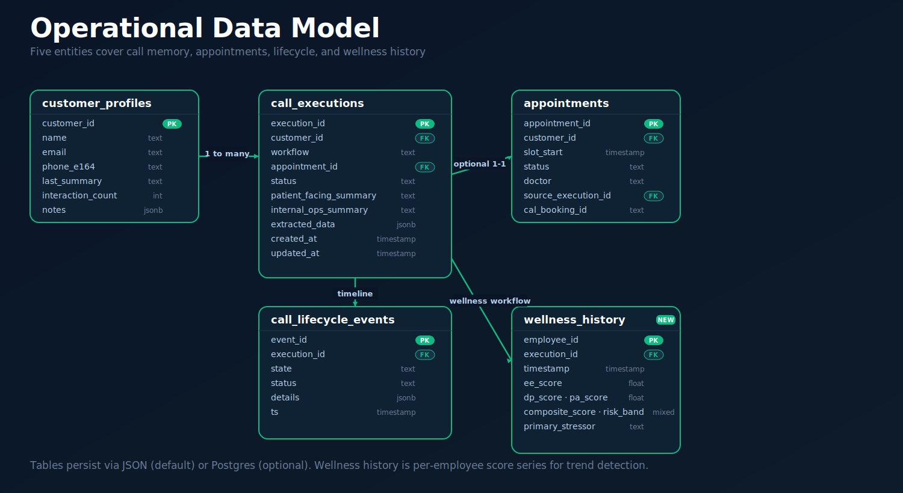
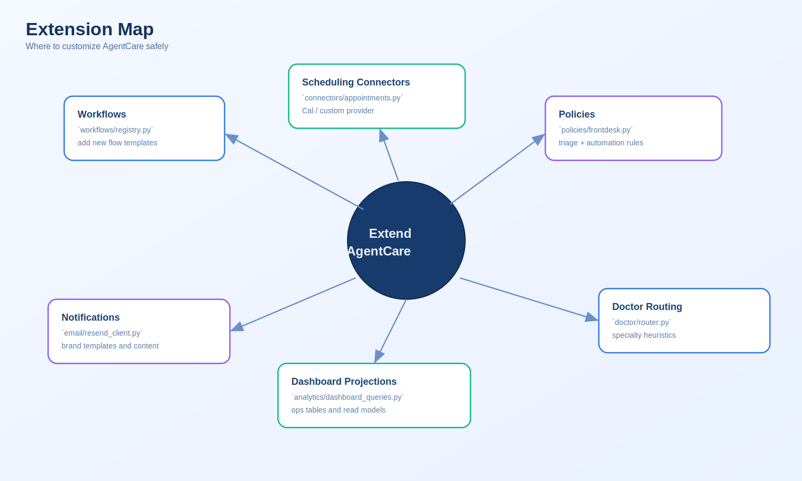

# AgentCare Architecture

AgentCare is built as a **library-first framework**:
- stable business logic in the library,
- thin FastAPI service adapters at runtime,
- plug-and-play provider integrations (Cal/Resend/Postgres/Bolna/Mistral).

---

## 1) Big Picture

### Why this shape
- You can swap providers without rewriting workflows.
- Web/API/CLI paths all reuse the same usecase logic.
- Testing is easier because usecases depend on contracts (ports), not SDKs.

---

## 2) Runtime View (What happens on a call)

---

## 3) Frontdesk Usecase Sequence

---

## 4) Data Model (Operational)

---

## 5) Layering Rules (Must Keep)

1. `usecases` depend on `ports` + domain rules only.
2. `ports` contain interfaces/contracts only (no provider imports).
3. Adapter modules implement those contracts:
   - `customer`, `connectors`, `email`, `analytics`, `extraction`
4. `services/*` are transport-only (HTTP in/out), not business logic.
5. Workflow definitions stay framework-level (`workflows/registry.py`).

---

## 6) Key Modules

- `src/agentcare/usecases/frontdesk.py`  
  Core end-to-end pipeline.

- `src/agentcare/usecases/deps.py`  
  Composition root: wires concrete adapters into usecase ports.

- `src/agentcare/ports/`  
  Contract boundary (`customer_store`, `appointments`, `notifier`, `extractor`, `analytics`).

- `src/agentcare/connectors/appointments.py`  
  Scheduling adapters (`cal`, `mock`).

- `src/agentcare/workflows/registry.py`  
  Workflow catalog (`frontdesk_booking`, `care_navigation`, `followup_outreach`).

- `src/agentcare/analytics/dashboard_queries.py`  
  Reusable read models/projections for dashboard APIs.

---

## 7) Storage Modes

### Local/demo mode
- `artifacts/customers.json`
- `artifacts/call_events.json`
- `artifacts/call_lifecycle_events.json`

### Production mode (Postgres)
- `customer_profiles`
- `processed_executions`
- `call_executions`
- `appointments`
- `call_lifecycle_events`

---

## 8) Extension Map

### Common extension tasks
- Add a new workflow type: update `workflows/registry.py` + usecase logic.
- Add new EHR/calendar provider: implement connector methods and map to port contract.
- Add new decision policy: extend `policies/frontdesk.py`.
- Add custom analytics tiles: add projections in `analytics/dashboard_queries.py`.

