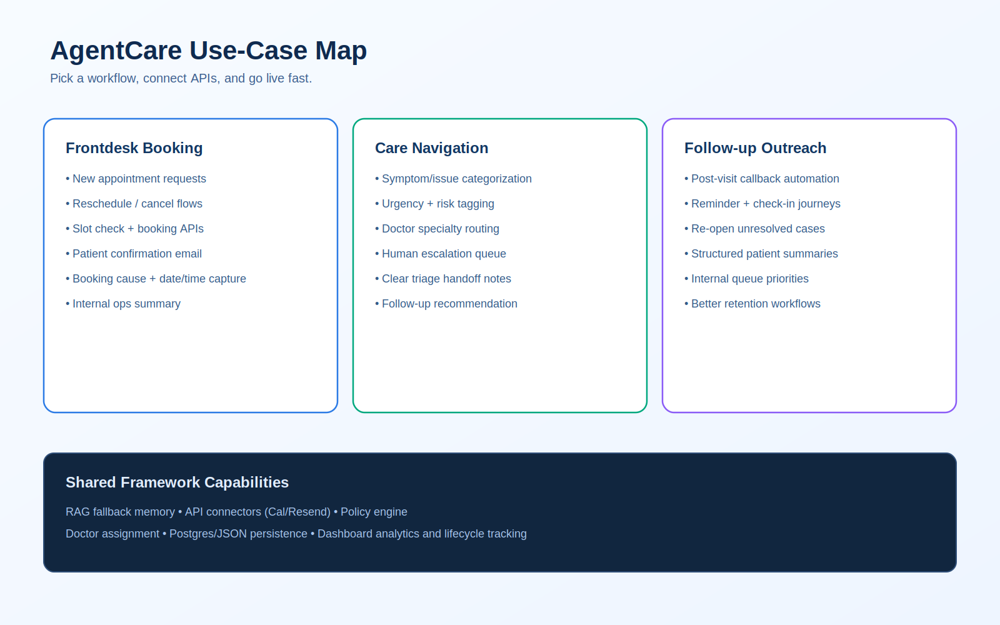
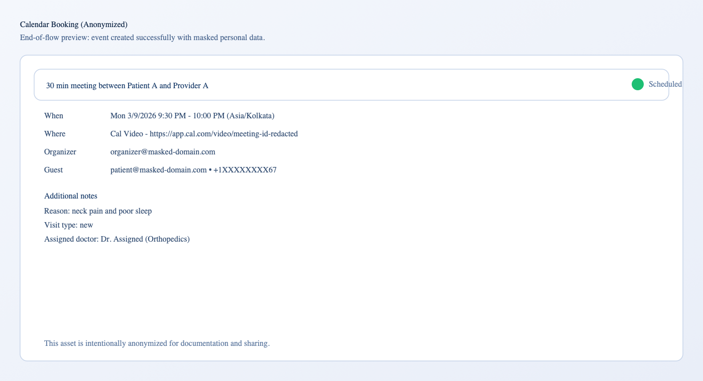
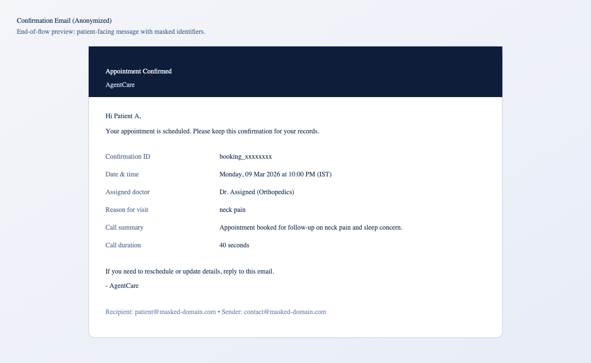

# AgentCare

[](https://www.python.org/downloads/)
[](https://opensource.org/licenses/MIT)
[](https://pypi.org/project/agentcare/)
[](https://pypi.org/project/agentcare/)
[](https://pypi.org/project/agentcare/)
[](https://pepy.tech/project/agentcare)

AgentCare is a library-first Python framework for building voice AI workflows: call intake, extraction, missing-data recovery, appointment orchestration, confirmation messaging, and operations analytics.

## Table of Contents

- [Product At A Glance](#product-at-a-glance)
- [First Run: Setup and Launch](#first-run-setup-and-launch)
- [URLs To Open](#urls-to-open)
- [Dashboard: What You Will See](#dashboard-what-you-will-see)
- [End-of-Flow Output Preview (Anonymized)](#end-of-flow-output-preview-anonymized)
- [Workflow Catalog](#workflow-catalog)
- [`.env` Reference (What To Fill)](#env-reference-what-to-fill)
- [End-to-End Flow](#end-to-end-flow)
- [Architecture + Codebase Layout](#architecture--codebase-layout)
- [Useful Commands](#useful-commands)
- [Architecture + Docs](#architecture--docs)
- [Quality Checks](#quality-checks)
- [Contributing](#contributing)

## Product At A Glance


- Converts call events into structured business actions.
- Uses memory search (RAG fallback) when customer data is missing.
- Supports Cal booking plus local mock EHR service for demos.
- Assigns doctor/specialty from reason + policy logic.
- Sends professional confirmation emails.
- Persists lifecycle + summary data for dashboard operations.




---

## First Run: Setup and Launch

This section is the fastest path to get a working local system (install -> configure -> run -> verify).

### 1) Install

```bash
pip install agentcare
```

For contributors/local development:

```bash
pip install -e ".[web,postgres,email,semantic,dev]"
```

Alternative `requirements.txt` flow:

```bash
pip install -r requirements.txt
pip install -r requirements-optional.txt   # if running local services/providers
pip install -r requirements-dev.txt        # if developing/testing
```

### 2) Create `.env`

```bash
cp .env.example .env
```

Add minimum values:
- `BOLNA_API_KEY`
- `MISTRAL_API_KEY`

### 3) Start the stack

```bash
python3 -m agentcare up
```

Dry run (no start, only validation/plan):

```bash
python3 -m agentcare up --dry-run
```

### 4) Open the product

Open dashboard:
- [http://127.0.0.1:8050](http://127.0.0.1:8050)

### 5) Run a safety check before sharing code

```bash
./scripts/check_no_secrets.sh
```

---

## URLs To Open

After `agentcare up`, open:

- Dashboard UI: [http://127.0.0.1:8050](http://127.0.0.1:8050)
- Analytics API health: [http://127.0.0.1:8040/healthz](http://127.0.0.1:8040/healthz)
- Webhooks health: [http://127.0.0.1:8030/healthz](http://127.0.0.1:8030/healthz)
- Mock EHR health: [http://127.0.0.1:8020/healthz](http://127.0.0.1:8020/healthz)
- LLM gateway health: [http://127.0.0.1:8010/healthz](http://127.0.0.1:8010/healthz)

Dashboard mock preview asset:
- `docs/assets/screenshots/dashboard-overview.svg` (anonymized sample data)

---

## Dashboard: What You Will See


Main sections:
- **Call Console**: place outbound calls and monitor lifecycle.
- **Workflow Status**: health of `llm_gateway`, `mock_ehr`, `webhooks`, and `analytics`.
- **Operational Case Queue**: triage/prioritization, conflict flags, recommended action.
- **Recent Executions**: latest call outcomes and costs.
- **Call Detail**: patient-facing and internal summaries per execution.
- **Appointments and Visit Details**: scheduled + pending entries with doctor and purpose.
- **Live behavior**: dashboard auto-refreshes status/executions/appointments/cases (no manual hard refresh needed during normal operation).

---

## End-of-Flow Output Preview (Anonymized)

Calendar booking output:



[Open calendar booking PNG](docs/assets/screenshots/endflow-calendar-booking-anonymized.png) · [Open calendar booking SVG](docs/assets/screenshots/endflow-calendar-booking-anonymized.svg)

Patient confirmation email output:



[Open email confirmation PNG](docs/assets/screenshots/endflow-email-confirmation-anonymized.png) · [Open email confirmation SVG](docs/assets/screenshots/endflow-email-confirmation-anonymized.svg)

Both assets are anonymized and safe to share in public docs.

---

## Workflow Catalog

List workflows:

```bash
python3 -m agentcare framework list-workflows
```

Built-in workflows:
- `frontdesk_booking`
- `care_navigation`
- `followup_outreach`

Create an agent from workflow:

```bash
python3 -m agentcare framework create-agent --workflow frontdesk_booking
```

---

## `.env` Configuration (Professional Setup)

Use `.env.example` as the template.
The easiest way to avoid confusion is to configure by profile:

### Profile A — Minimum runnable (local testing)

Set these first:

| Variable | Why it is needed |
|---|---|
| `BOLNA_API_KEY` | Required for call orchestration APIs |
| `MISTRAL_API_KEY` | Required for extraction/evaluation logic |

You can run with just these plus defaults.

### Profile B — Recommended for full product flow

Add these to enable complete call -> booking -> email -> dashboard operations:

| Variable | Why it is needed |
|---|---|
| `BOLNA_BASE_URL` | Explicit provider endpoint |
| `BOLNA_AGENT_ID` | Default agent for CLI/service operations |
| `BOLNA_FROM_NUMBER` | Outbound caller identity |
| `MISTRAL_MODEL` | Controls extraction/eval model behavior |
| `AGENTCARE_LLM_GATEWAY_URL` | Local LLM gateway routing |
| `AGENTCARE_MOCK_EHR_URL` | Local scheduling service endpoint |
| `CAL_API_KEY` | Real booking integration |
| `CAL_EVENT_TYPE_ID` | Cal event type mapping |
| `CAL_TIMEZONE` | Booking time normalization |
| `RESEND_API_KEY` | Email delivery provider auth |
| `AGENTCARE_EMAIL_FROM` | Sender identity for confirmations |
| `CUSTOMER_STORE_BACKEND` | Storage mode (`auto`, `json`, `postgres`) |
| `CUSTOMER_STORE_PATH` | JSON memory path for local mode |
| `PROCESSED_EXECUTIONS_PATH` | Idempotency tracking path |
| `SUPABASE_URL` | Supabase project reference |
| `SUPABASE_PUBLISHABLE_KEY` | Supabase project key |
| `SUPABASE_DB_URL` | Postgres connection for production-grade persistence |

### Profile C — Advanced/optional

Use only if you need custom behavior:

| Variable | When to use it |
|---|---|
| `APPOINTMENT_CONNECTOR_BACKEND` | Switch connector mode explicitly (`cal` or `mock`) |
| `FRONTDESK_POLICY_PATH` | Load external policy rules JSON |

Note: `*_PATH` keys (for example `CUSTOMER_STORE_PATH`, `PROCESSED_EXECUTIONS_PATH`) are optional and can usually be left as defaults.

### Practical rule

- If you are onboarding quickly: start with **Profile A**, then add **Profile B**.
- If your team needs custom routing/rules: add **Profile C**.

### Artifacts and privacy

- `artifacts/` is local runtime data and is git-ignored by default.
- Do **not** commit raw artifacts from real calls.
- If you need shareable demos, create an anonymized export (mask names, emails, phones, booking IDs).
- Keep `.env` local only; never commit it.

Custom artifact paths can be configured with:
- `CUSTOMER_STORE_PATH`
- `PROCESSED_EXECUTIONS_PATH`

---

## End-to-End Flow

1. Ingest call execution event (webhook/sync/manual).
2. Extract structured data from transcript.
3. Backfill missing fields from memory search.
4. Evaluate policy/risk and assign doctor.
5. Check slot + book appointment via connector.
6. Send patient confirmation email.
7. Persist call lifecycle, summaries, and analytics.
8. Display operations state in dashboard.

Reliability notes:
- Dashboard status polling reconciles live provider status to avoid stale "in-progress" UI states.
- Completed call status can trigger backend processing as a safety net when webhook delivery is delayed.

---

## Architecture + Codebase Layout

### Layered architecture (quick view)


- **CLI / Services**: entry points (`python -m agentcare`, FastAPI apps).
- **Usecases**: business orchestration (single source of truth for workflow logic).
- **Ports**: interface contracts to keep core logic provider-agnostic.
- **Adapters**: concrete implementations for booking, email, memory, analytics.
- **External**: Bolna, Mistral, Cal, Resend, Supabase/Postgres.

### Operational data model (what is stored)


Main entities:
- `customer_profiles`: canonical patient/customer identity + latest memory.
- `call_executions`: per-call outcomes, summaries, extracted data.
- `appointments`: booking records linked to customer + execution.
- `call_lifecycle_events`: state timeline for call observability.

### Codebase layout (where things live)

```text
src/agentcare/
  usecases/        # workflow/business orchestration
  ports/           # contracts/interfaces
  connectors/      # appointment connectors (cal, mock)
  customer/        # memory stores (json/postgres)
  email/           # resend notifier
  analytics/       # persistence + dashboard query layer
  workflows/       # workflow registry and metadata
  policies/        # decision logic (automation/triage)
  doctor/          # doctor assignment logic
  cli.py           # command entrypoints

services/
  webhooks/        # ingestion API adapter
  analytics/       # metrics API adapter
  dashboard/       # dashboard API + static UI
  llm_gateway/     # local openai-compatible gateway
  mock_ehr/        # local mock scheduling service

scripts/
  dev/run helpers and safety checks
```

### Request path (design intent)

`services/webhooks` -> `usecases/frontdesk` -> `ports` -> adapters (`customer/connectors/email/analytics`) -> external APIs/storage.

This structure keeps transport concerns separate from business logic and makes the framework easier to test, extend, and maintain.

---

## Useful Commands

```bash
python3 -m agentcare doctor
python3 -m agentcare framework provider-test
python3 -m agentcare framework list-workflows
python3 -m agentcare framework process-execution --execution-json artifacts/sample_execution.json
python3 -m agentcare up --dry-run
```

---

## Architecture + Docs

- This `README.md` is the primary all-in-one guide (setup + run + architecture + flow).
- Main architecture reference (optional deep dive): `ARCHITECTURE.md`
- Docs hub (optional): `docs/README.md`
- Setup guide (optional): `docs/setup/one-command-local.md`
- Services map (optional): `docs/api/services.md`

---

## Quality Checks

```bash
pytest -q
python3 -m build
twine check dist/*
```

## Contributing

See `CONTRIBUTING.md` and `CHANGELOG.md`.