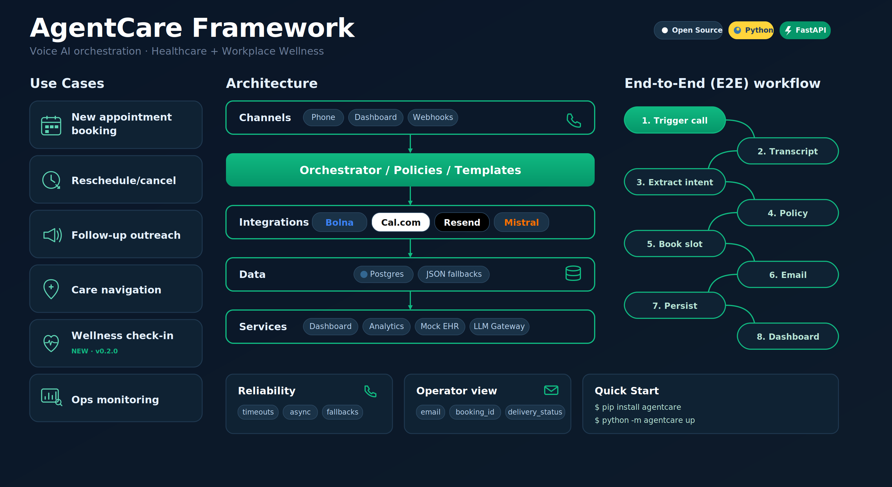
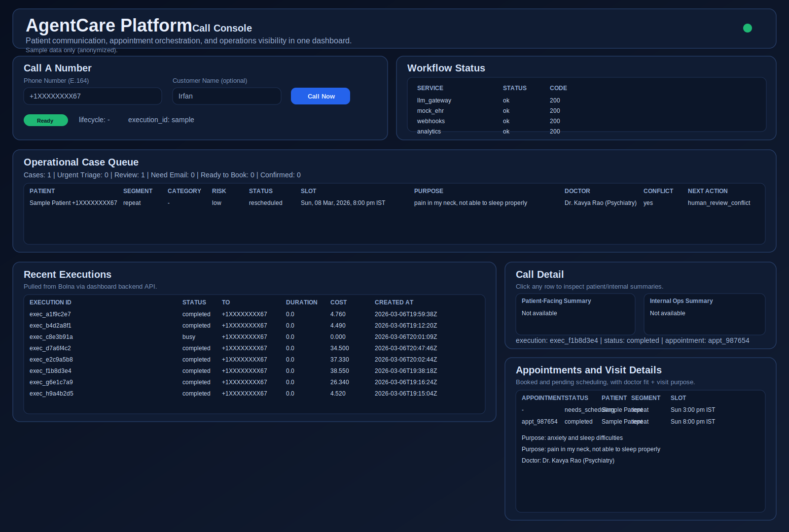
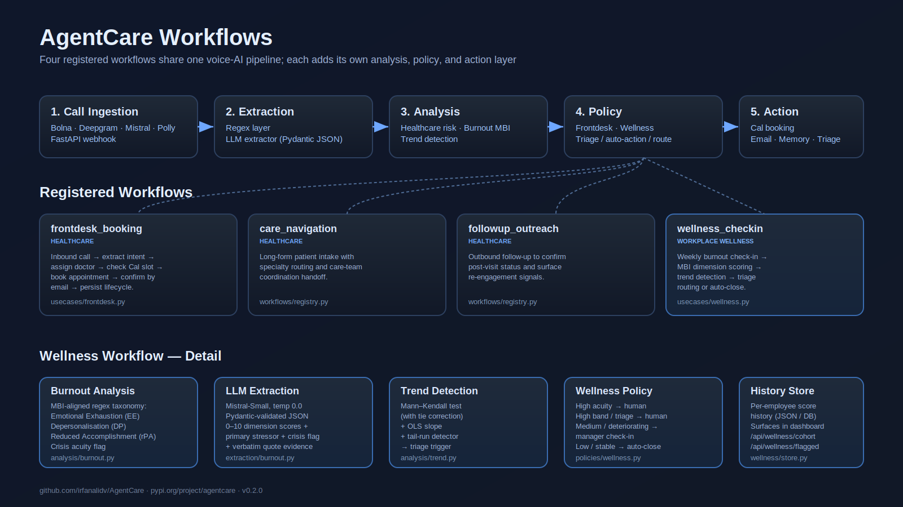

# AgentCare

[](https://www.python.org/downloads/)
[](https://opensource.org/licenses/MIT)
[](https://pypi.org/project/agentcare/)
[](https://pypi.org/project/agentcare/)
[](https://pypi.org/project/agentcare/)
[](https://pepy.tech/project/agentcare)

AgentCare is a Python framework for building voice-AI workflows that turn phone conversations into structured business actions. It handles the parts that are tedious to do well: ingesting call events, extracting structured data from messy transcripts, recovering missing fields from memory, applying domain policy, and dispatching the resulting action — booking, escalation, follow-up, or triage — through provider-agnostic adapters.

Four workflows ship registered out of the box: three for healthcare front-desk use cases (booking, navigation, follow-up) and one for workplace burnout detection. The same five-stage pipeline runs all four; what differs is the analysis and policy layer plugged in at each end.

```
pip install agentcare
```

## Contents

- [What it does](#what-it-does)
- [Quick start](#quick-start)
- [URLs after launch](#urls-after-launch)
- [Workflows](#workflows)
- [The wellness workflow](#the-wellness-workflow)
- [Configuration](#configuration)
- [Architecture](#architecture)
- [Reproducible experiments](#reproducible-experiments)
- [Useful commands](#useful-commands)
- [Quality and contribution](#quality-and-contribution)
- [Academic provenance](#academic-provenance)

## What it does



AgentCare converts call lifecycle events into the actions a real operations team would take. A call lands; the framework extracts intent and structured fields from the transcript using a combination of regex and an LLM under a strict JSON contract; if the customer record is incomplete it falls back to memory search; a domain-specific analysis layer scores risk, signals, or trends; a policy layer turns that into a routing decision; and an adapter executes the action — confirming a booking through Cal, sending an email through Resend, or pushing a case to a triage queue. Every step is persisted, so the dashboard shows you what happened and why.

The library is provider-agnostic by design. Bolna handles real-time telephony today, but the call-ingestion port does not depend on it. Mistral is the default extractor, but the LLM port accepts any OpenAI-compatible endpoint. Cal and Resend are the bundled connectors, but adding a new one is a matter of writing an adapter against the existing port — the business logic does not change.


## Quick start

```bash
pip install agentcare
cp .env.example .env       # then add BOLNA_API_KEY and MISTRAL_API_KEY
python -m agentcare up
```

That brings up the full local stack — webhook adapter, analytics API, dashboard, mock EHR, and a local OpenAI-compatible LLM gateway — on five ports. For a dry run that validates configuration without starting any service, append `--dry-run`.

For local development against a checkout:

```bash
git clone https://github.com/irfanalidv/AgentCare
cd AgentCare
pip install -e ".[web,postgres,email,semantic,dev]"
```

## URLs after launch

| Service           | URL                                       |
| ----------------- | ----------------------------------------- |
| Dashboard         | http://127.0.0.1:8050                     |
| Analytics health  | http://127.0.0.1:8040/healthz             |
| Webhooks health   | http://127.0.0.1:8030/healthz             |
| Mock EHR health   | http://127.0.0.1:8020/healthz             |
| LLM gateway       | http://127.0.0.1:8010/healthz             |

The dashboard auto-refreshes its status, executions, appointments, and case-queue panels on a short polling interval — there should be no need to hard-refresh during normal use.



## Workflows



```
$ python -m agentcare framework list-workflows
frontdesk_booking      Healthcare front-desk: extract → assign → book → confirm
care_navigation        Healthcare intake: long-form, specialty routing, care-team handoff
followup_outreach      Outbound post-visit follow-up and re-engagement signals
wellness_checkin       Workplace burnout check-in with MBI scoring and trend triage
```

To create an agent for a specific workflow:

```bash
python -m agentcare framework create-agent --workflow frontdesk_booking
```

All four workflows share the same call-ingestion, extraction, and persistence machinery. The differences live in the analysis module (`src/agentcare/analysis/`), the policy module (`src/agentcare/policies/`), and the use-case orchestrator (`src/agentcare/usecases/`). A new workflow is added by registering a `WorkflowDefinition` and writing a use-case that wires the dependencies it needs through the relevant ports.

## The wellness workflow

`wellness_checkin` was added in v0.2.0 as a first-class peer to the healthcare workflows. It runs a short weekly conversational check-in with an employee, extracts MBI-aligned burnout signals from the transcript, tracks the score history per employee, and routes the result to one of three actions: auto-close, manager check-in, or confidential human follow-up.

The analysis layer scores the three Maslach Burnout Inventory dimensions — emotional exhaustion, depersonalisation, and reduced personal accomplishment — using a regex taxonomy fused with an LLM extractor under a Pydantic-validated JSON schema. The trend layer applies the Mann–Kendall test (with tie correction) and an OLS slope to the per-employee score history; a triage trigger fires on three consecutive worsening sessions, on a composite score crossing 7.0, or on a deteriorating trend with a latest score above 5.0. Crisis cues — explicit hopelessness, self-harm references, breakdown language — are scored on a separate acuity flag that overrides the policy regardless of dimension scores.

Operations data is exposed through the dashboard:

```
GET /api/wellness/cohort                  cohort summary by latest band
GET /api/wellness/flagged                 employees flagged for follow-up
GET /api/wellness/employee/{employee_id}  full session history + recomputed trend
GET /api/wellness/series?limit=50         per-employee composite trajectories
```

The store is a JSON file by default (`artifacts/wellness_history.json`), backed by the `WellnessHistoryStorePort` interface — swap in a Postgres adapter without touching use-case code.

## Configuration

The runtime reads from environment variables, conventionally loaded from `.env`. Two keys are mandatory: `BOLNA_API_KEY` for call orchestration and `MISTRAL_API_KEY` for extraction. Everything else has a default.

For the full feature surface — booking through Cal, confirmation email through Resend, postgres-backed memory, and so on — add the following:

| Variable | Purpose |
|---|---|
| `BOLNA_BASE_URL`, `BOLNA_AGENT_ID`, `BOLNA_FROM_NUMBER` | Provider endpoint, default agent, outbound caller identity |
| `MISTRAL_MODEL` | Extraction and evaluation model |
| `AGENTCARE_LLM_GATEWAY_URL`, `AGENTCARE_MOCK_EHR_URL` | Local service endpoints |
| `CAL_API_KEY`, `CAL_EVENT_TYPE_ID`, `CAL_TIMEZONE` | Booking integration |
| `RESEND_API_KEY`, `AGENTCARE_EMAIL_FROM` | Email delivery |
| `CUSTOMER_STORE_BACKEND`, `CUSTOMER_STORE_PATH` | Memory backend (`auto` / `json` / `postgres`) and JSON path |
| `WELLNESS_HISTORY_STORE_PATH` | Wellness score history (default `artifacts/wellness_history.json`) |
| `PROCESSED_EXECUTIONS_PATH` | Idempotency tracking |
| `SUPABASE_URL`, `SUPABASE_PUBLISHABLE_KEY`, `SUPABASE_DB_URL` | Postgres-backed persistence |

Two switches are useful for advanced setups: `APPOINTMENT_CONNECTOR_BACKEND` (`cal` or `mock`) and `FRONTDESK_POLICY_PATH` (load policy rules from JSON).

The `artifacts/` directory holds runtime state — call summaries, customer profiles, processed-execution records, wellness history. It is git-ignored. Do not commit raw artefacts from real calls; if you need a public demo, anonymise names, emails, phone numbers, and booking IDs first. Do not commit `.env`.

## Architecture

The codebase follows hexagonal-architecture conventions: business logic in use-cases, transport-specific code in services and adapters, stable contracts in ports.

```
src/agentcare/
  usecases/         workflow orchestration; one module per registered workflow
  ports/            interface contracts (provider-agnostic)
  connectors/       appointment connectors (cal, mock)
  customer/         memory store implementations (json, postgres)
  email/            resend notifier
  analysis/         risk and signal analysis (healthcare, burnout, trend)
  extraction/       transcript → structured data (LLM + regex)
  policies/         policy decision logic (frontdesk, wellness)
  workflows/        registry and metadata
  wellness/         wellness history store
  cli.py            command entry points

services/
  webhooks/         call lifecycle ingestion
  analytics/        operations metrics API
  dashboard/        dashboard API + static UI
  llm_gateway/      local OpenAI-compatible endpoint
  mock_ehr/         local mock scheduling

experiments/        reproducible benchmark layer (separate install)
scripts/            development and operational helpers
```

A single execution router (`usecases/execution_router.py`) selects the workflow at runtime — by explicit `workflow` parameter, by Bolna agent name fallback, or by registry default — so the same pipeline serves webhook, sync, dashboard, and CLI ingestion without duplication.


The four entities that matter for operations are `customer_profiles` (canonical identity plus latest memory), `call_executions` (per-call outcomes, summaries, extracted fields), `appointments` (booking records linked to customer and execution), and `call_lifecycle_events` (state timeline for observability). The wellness workflow adds a per-employee score history that lives alongside these.

## Reproducible experiments

The `experiments/` directory is a separate benchmark layer with heavier dependencies (scikit-learn, numpy, matplotlib) that the runtime does not need. It exists to reproduce the quantitative results that motivate design choices in the wellness workflow — extraction quality, trend-detection accuracy, predictive modelling at a four-session horizon, and adversarial robustness on edge-case transcripts.

```bash
pip install -r experiments/requirements.txt
bash scripts/run_all_experiments.sh
```

A deterministic synthetic corpus (180 employees × 8 sessions, seeded) is generated, all four experiments run in sequence, and results land as JSON metrics, CSV predictions, PNG figures, and pickled models in `experiments/output/`. Total runtime is roughly 30 seconds. See `experiments/README.md` for the headline numbers and how to interpret them.

## Useful commands

```bash
python -m agentcare doctor                                              # diagnose configuration
python -m agentcare framework provider-test                             # check provider connectivity
python -m agentcare framework list-workflows                            # registered workflows
python -m agentcare framework create-agent --workflow frontdesk_booking # provision an agent
python -m agentcare framework process-execution \                       # replay an execution offline
    --execution-json artifacts/sample_execution.json
python -m agentcare up --dry-run                                        # validate without starting
./scripts/check_no_secrets.sh                                           # pre-commit safety check
```

## Quality and contribution

```bash
pytest -q
python -m build && twine check dist/*
```

The full suite includes the burnout analysis, trend detection, wellness use-case, execution router, and frontdesk regression tests. See `CONTRIBUTING.md` for the development workflow and `CHANGELOG.md` for the version history. The architecture deep-dive lives in `ARCHITECTURE.md`.

## Academic provenance

The `wellness_checkin` workflow and the accompanying `experiments/` layer were developed as the deliverable for the M.Sc. Data Science & AI individual project at the Indian Institute of Science Education and Research (IISER) Tirupati, prepared for May 2026 submission. The design and methodology — MBI dimension mapping, Mann–Kendall trend detection, and the predictive model targeting future burnout at a multi-session horizon — are documented in the project's end-semester report. The healthcare workflows (`frontdesk_booking`, `care_navigation`, `followup_outreach`) and the underlying framework predate this work and remain the project's primary contribution as an open-source library.
