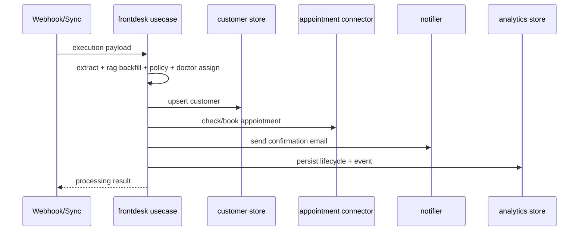

# Data Flow

## Output contract highlights

- `patient_facing_summary`: concise confirmation-safe summary.
- `internal_ops_summary`: operational context for dashboard and triage.
- `rag_backfill`: metadata showing whether memory fallback was used.
