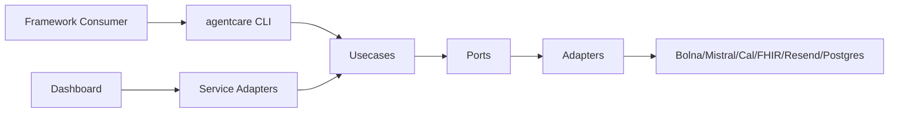

# System Map

## Responsibility split

- Library (`src/agentcare`): orchestration, contracts, adapters, workflow registry.
- Services (`services/*`): HTTP transport and operational runtime.
- Scripts (`scripts/*`): local DX helpers.
